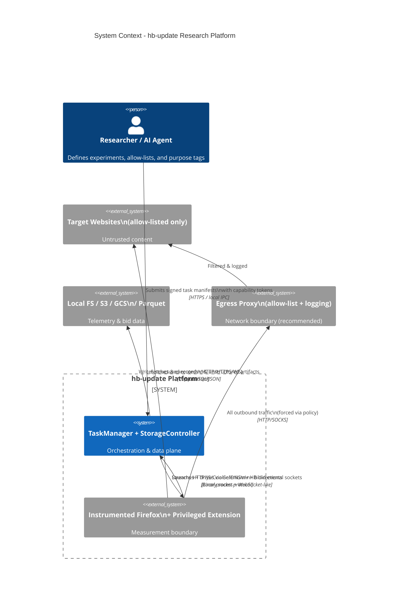
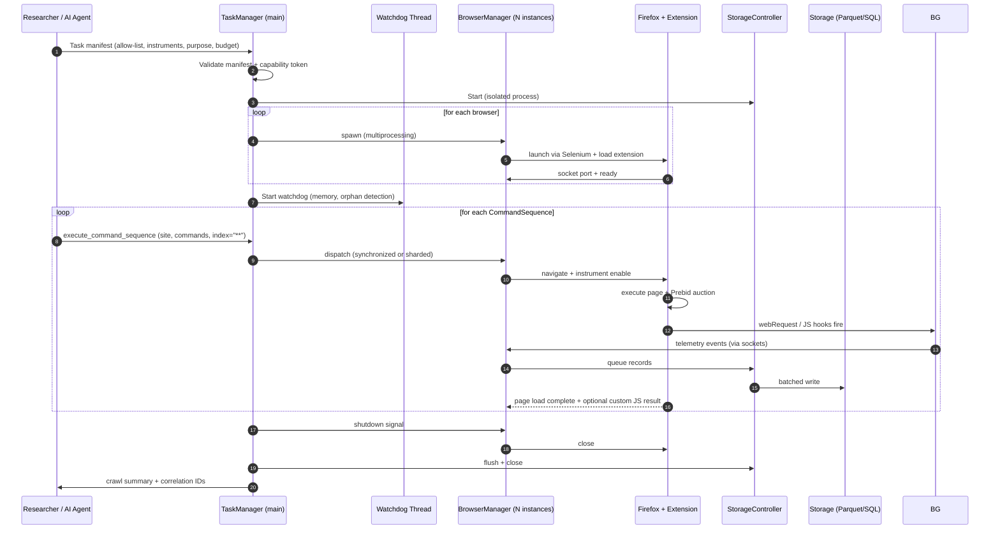
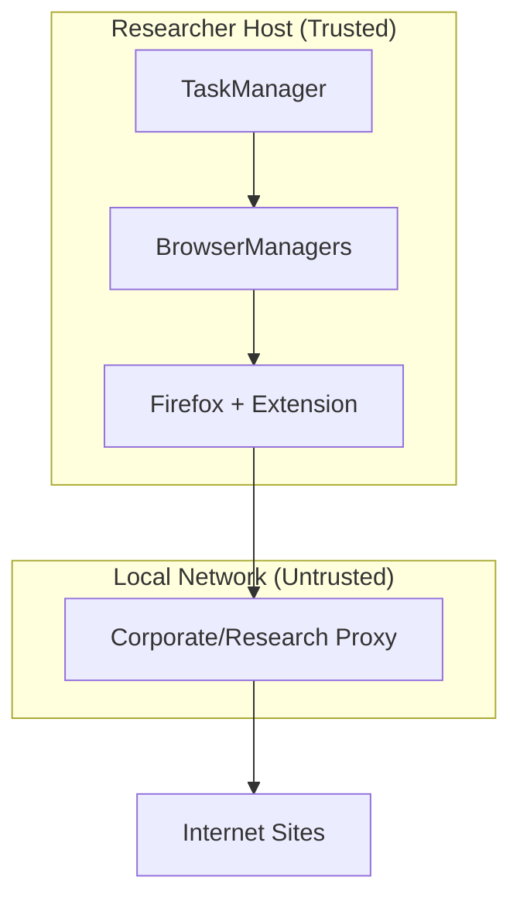

# Architecture Specification

**hb-update: Header Bidding Research Platform**  
**Document Version**: 1.1.0  
**Date**: 2026-04-26  
**Status**: Authoritative technical architecture for the modernized platform  
**Related Documents**: [Security-Hardening.md](docs/Security-Hardening.md), [Configuration.md](docs/Configuration.md), [AGENTS.md](AGENTS.md)

---

## 1. Executive Summary & Architectural Principles

hb-update is a **distributed, multi-process research measurement platform** specialized for deep instrumentation of web advertising auctions (Header Bidding / Prebid.js) while retaining the general web privacy measurement capabilities of its OpenWPM foundation.

**Core Design Goals**:
- **Maximum observability** of HTTP, JavaScript execution, cookies, DNS, and real-time bidding telemetry.
- **Reproducibility** and parallelism at scale (dozens to thousands of browsers).
- **Researcher safety and data protection** through explicit security boundaries, isolation, and auditability (see Security-Hardening.md).
- **Extensibility** via a typed command model and pluggable storage backends.

**Guiding Principles** (Security-First):
- Least privilege for every browser instance and every command sequence.
- Explicit trust boundaries between untrusted web content, the privileged extension, the Python orchestration layer, and persistent storage.
- Fail-closed: unknown sites, unknown commands, and anomalous behavior are rejected.
- Auditability: every significant action is logged with correlation identifiers.
- Defense in depth: process isolation + network policy + profile sandboxing + data redaction.

The platform is currently in a **hybrid modernization state**:
- **Modern core**: `openwpm/` (Python 3.10+), TypeScript `Extension/`, modern CI, dataclasses configuration.
- **Legacy research layer**: `TrackerProject/` (HB-specific A/B testing, ML pipelines, file-based coordination with known integrity and path issues).

All new development must occur in the modern core. Legacy components are scheduled for migration or retirement.

---

## 2. System Context (C4-Style)



**Key External Entities**:
- Researcher or AI Agent: Supplies allow-lists and purpose; receives redacted/aggregated results.
- Egress Proxy (mandatory in hardened deployments): Enforces destination policy and provides network audit trail.

---

## 3. High-Level Component Architecture & Trust Boundaries

```mermaid
flowchart TB
    subgraph External["External / Untrusted"]
        SITES[Target Sites\n(allow-listed)]
    end

    subgraph MeasurementBoundary["Measurement Boundary (High Privilege)"]
        direction TB
        FF[Firefox +<br/>WebExtension<br/>(privileged experiment APIs)]
        subgraph Extension["Extension (TypeScript)"]
            BG[Background Scripts<br/>(HTTP, JS, Cookie, DNS, Nav instruments)]
            PRIV[Privileged APIs<br/>sockets / profileDirIO / stackDump]
        end
    end

    subgraph Orchestration["Orchestration Layer (Trusted)"]
        BM[BrowserManager<br/>(per browser process)]
        TM[TaskManager<br/>(orchestrator + watchdog)]
        SC[StorageController<br/>(isolated writer)]
    end

    subgraph Data["Data & Storage Layer"]
        SQLITE[(SQLite)]
        PARQUET[(Parquet<br/>datasets)]
        LEVELDB[(LevelDB<br/>unstructured)]
        CLOUD[(S3 / GCS)]
    end

    subgraph Legacy["Legacy HB Research Layer (Transitioning)"]
        TP[TrackerProject<br/>TrainingCrawl / A/B / ML]
        HBJSON[Bid JSON files<br/>(race-prone)]
    end

    SITES -->|untrusted content| FF
    FF <-->|binary socket protocol| BM
    BM <-->|queues + dill/pickle IPC| TM
    TM -->|commands| BM
    BM -->|telemetry records| SC
    SC -->|append-only writes| SQLITE & PARQUET & LEVELDB & CLOUD

    TP -.->|site batches +<br/>custom JS| TM
    TP -->|bid harvesting<br/>via execute_script| FF
    FF -->|raw pbjs objects| TP
    TP -->|JSON state machines| HBJSON

    classDef untrusted fill:#ffebee,stroke:#c62828
    classDef measurement fill:#fff8e1,stroke:#f57c00
    classDef trusted fill:#e8f5e9,stroke:#2e7d32
    classDef legacy fill:#fce4ec,stroke:#ad1457
    class SITES untrusted
    class FF,PRIV,Extension measurement
    class TM,BM,SC trusted
    class TP,HBJSON legacy
```

**Trust Boundaries** (critical for Zero Trust):

1. **Untrusted Web Content** ↔ **Measurement Boundary** (extension): Full attack surface. Mitigated by Firefox sandbox + extension CSP + instrument allow-lists.
2. **Measurement Boundary** ↔ **Orchestration Layer**: Socket protocol + command serialization. Authenticated locally via port and process identity.
3. **Orchestration** ↔ **Storage**: Isolated StorageController process prevents direct DB contention and provides a single serialization point.
4. **Legacy Layer** ↔ **Everything**: Lowest trust. File-based coordination is a known integrity and availability weakness.

---

## 4. Runtime Process Model



**Process Isolation Guarantees**:
- Each BrowserManager runs in its own OS process.
- StorageController is deliberately isolated to serialize writes.
- MPLogger provides cross-process structured logging.
- Watchdog can terminate and restart individual browsers without killing the entire run.

---

## 5. Data Flow & Sensitivity

### 5.1 Primary Telemetry Flow

```mermaid
flowchart LR
    subgraph Page["Page Context (Untrusted)"]
        PBJS[Prebid.js Auction]
        SENS[Sensitive JS APIs<br/>canvas, webgl, audio, fonts...]
    end

    subgraph Extension["Extension Chrome (Privileged)"]
        HTTP[http-instrument]
        JS[js-instrument + stackDump]
        CK[cookie-instrument]
        DNS[dns-instrument]
    end

    HTTP -->|req/resp + body + callstack| Q1[(In-memory queue)]
    JS -->|property access + args + stack| Q1
    CK -->|set + profile cookies| Q1
    DNS -->|lookups| Q1

    Q1 -->|binary socket| SC[StorageController]
    SC -->|schema validation| PARQUET[Parquet<br/>site_visits, http_requests,<br/>javascript, cookies...]
    SC -->|optional| REDACT[Redaction Pipeline<br/>(PII, bodies, high-entropy)]
    REDACT --> CLOUD[(S3/GCS<br/>encrypted buckets)]

    classDef sensitive fill:#ffcdd2
    class PBJS,SENS sensitive
```

### 5.2 Header Bidding Harvest Flow (Legacy Path)

1. `TrainingCrawl` selects site batch + A/B variant.
2. CommandSequence includes `run_custom_function(ScriptUtils.getCPM)`.
3. In page context: `pbjs.getBidResponses()` + `getAllWinningBids()` executed.
4. Results returned to Python, written to `results/bids_{intent}/...` as JSON + `testingDone.json` mutex.
5. ML pipeline later reads these files for feature extraction.

**Known Weaknesses**: Race conditions on mutex files, no schema enforcement on bid objects, absolute paths.

### 5.3 Data Sensitivity Classification (Mandatory)

| Data Category | Examples | Sensitivity | Required Controls |
|---------------|----------|-------------|-------------------|
| Raw HTTP bodies & headers | POST data, auth tokens (accidental), referrers | High | Redact by default; encrypt at rest; short retention |
| JS call stacks + arguments | Fingerprinting vectors, PII in strings | High | Hash or truncate; never feed raw to LLMs |
| Bid telemetry (CPM, bidder, adUnit) | Precise revenue signals + interest inference | High (regulatory) | Classification label + purpose limitation |
| Cookies (document + profile) | Tracking identifiers, login state | High | Hash where possible; never export raw |
| Derived ML profiles | Interest vectors from bids | Critical | Separate access control; DPIA required |

All storage schemas (see `openwpm/storage/parquet_schema.py` and `schema.sql`) must carry sensitivity annotations in future revisions.

---

## 6. Configuration & Command Model

**Modern Configuration** (dataclasses – see `openwpm/config.py`):

- `ManagerParams`: `num_browsers`, `data_directory`, `log_path`, failure limits, storage backend selection.
- `BrowserParams`: per-browser instrumentation toggles, `js_instrument_settings` (list of collections or custom dicts), `display_mode`, profile seeds, prefs, blocking extensions.

**Command Model**:
- Commands inherit from `BaseCommand` and implement `execute()`.
- Built-ins: `GetCommand`, cookie dumps, custom JS execution, profile archiving.
- Custom commands are the primary extension point for HB-specific logic.

**Security Contract**:
- Every command sequence must be validated against the active allow-list and capability token before any browser navigation occurs.
- Instrument flags are immutable after browser launch (prevent privilege escalation mid-crawl).

---

## 7. Storage Architecture

- **Structured**: Parquet (preferred for analytics) + SQLite (operational). Schemas must stay in sync (`parquet_schema.py` ↔ `schema.sql`).
- **Unstructured**: LevelDB for large blobs or raw content (when `save_content` enabled).
- **Cloud**: Optional S3/GCS providers with server-side encryption + bucket policies.
- **Isolation**: All writes go through the single StorageController process.

Future: Add encryption-at-rest provider and redaction transform stage.

---

## 8. Deployment Views

### 8.1 Local Research Workstation (Development)



**Hardening**: Full-disk encryption, no browser persistence, dedicated non-admin user, egress proxy mandatory.

### 8.2 Container / Kubernetes (Recommended for Production Research)

- One `TaskManager` pod (or Job) per experiment.
- Browser pods (or sidecars) with:
  - `securityContext`: non-root, read-only root FS where possible, seccomp profiles.
  - NetworkPolicy: deny all except proxy + storage endpoints.
- Storage: PVCs with encryption or object storage with KMS.
- Init containers for profile seeding and allow-list injection.

See [docs/Deployment.md](docs/Deployment.md) for manifests and hardening.

### 8.3 Air-Gapped / High-Security

Complete isolation: import allow-lists and site seeds via signed USB, export only redacted aggregates. No cloud storage.

---

## 9. Interface & Schema Contracts

- **Public Python API**: `openwpm.config`, `openwpm.task_manager`, `openwpm.commands`.
- **Extension ↔ Python**: Binary length-prefixed protocol over localhost sockets (defined in `privileged/sockets/` and `openwpm/socket_interface.py`).
- **Storage Schema**: Versioned. Breaking changes require migration scripts and major version bump.
- **JS Instrument Settings**: JSON Schema validated (`schemas/js_instrument_settings.schema.json`).

All contracts must be machine-readable and tested.

---

## 10. Modernization & Evolution Roadmap

| Phase | Focus | Key Architectural Changes | Security Impact |
|-------|-------|---------------------------|-----------------|
| Current (2026 Q2) | Stabilization | Modern core + docs; legacy TrackerProject quarantined | Improved maintainability; legacy risk isolated |
| Phase 1 | Containment | Capability tokens, egress proxy enforcement, redaction pipeline, audit logging | Major reduction in blast radius & data exposure |
| Phase 2 | Modernization | Deprecate TrackerProject; Manifest V3 or BiDi migration; typed HB module | Removal of legacy attack surface |
| Phase 3 | Platform | Multi-browser support (Chromium via CDP), confidential computing options, formal provenance | Future-proofing + regulatory readiness |

---

## 11. Diagram & Documentation Maintenance

- All Mermaid diagrams in this document are the source of truth.
- Architecture changes require updates to this file + Security-Hardening.md + relevant sequence diagrams.
- `docs/schemas/` are auto-generated from JSON Schema via `npm run render_schema_docs`.
- Review this document on every major release or when trust boundaries change.

**Full file path of this document**: `docs/Architecture.md`

---

*This architecture prioritizes research utility while embedding the security controls required for responsible, auditable web measurement at scale.*
