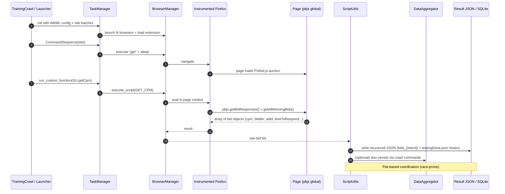

# Architecture

**HeaderBidding Research Platform – Technical Architecture**  
**Version**: 0.8.0-hb (research snapshot)  
**Date**: 2026-04  
**Status**: Legacy research codebase with documented gaps

---

## 1. Executive Summary

The HeaderBidding platform is a **measurement and experimentation harness** for studying real-time header bidding (HB) auctions. It is a specialized fork/extension of OpenWPM that adds Prebid.js (`pbjs`) telemetry extraction, A/B blocking experiments, and ML-based bid profile generation.

**Core Principle**: Launch many instrumented, isolated browser instances in parallel, drive them through reproducible command sequences against curated site lists, and capture the maximum observable surface of HTTP, JavaScript, cookie, and advertising auction activity.

**Primary Data Products**:
- Rich HTTP + JS + cookie telemetry (privacy measurement)
- Detailed per-bid records (bidder, CPM, latency, win/loss, ad unit)
- Derived user interest profiles from bid patterns

---

## 2. High-Level System Architecture

```mermaid
flowchart TB
    subgraph Orchestration
        TM[TaskManager]
        WD[Watchdog Thread]
        LS[MPLogger Server]
    end

    subgraph Workers
        B1[BrowserManager #1<br/>+ Selenium + geckodriver]
        B2[BrowserManager #N]
    end

    subgraph InstrumentedBrowsers
        FF1[Firefox +<br/>Instrumentation Extension]
        FF2[Firefox +<br/>Instrumentation Extension]
    end

    subgraph DataPlane
        DA[DataAggregator<br/>(Local / S3)]
        SQLite[(SQLite)]
        Parquet[Parquet Files]
    end

    subgraph HBLayer[Header Bidding Research Layer]
        TC[TrainingCrawl /<br/>A/B Orchestrator]
        SU[ScriptUtils<br/>pbjs injection]
        HBL[HBLogger]
        ML[ML Pipeline<br/>Bid Collection →<br/>Profile Gen → Training]
    end

    Sites[Target Sites<br/>(Alexa categories +<br/>custom lists)] -->|CommandSequence.get| FF1
    Sites --> FF2

    TM -->|spawn + queues| B1
    TM --> B2
    TM --> DA
    TM --> LS
    WD -.->|memory / orphan<br/>process checks| B1

    B1 <-->|socket / dill| FF1
    B2 <--> FF2

    FF1 -->|instrumented events| DA
    FF2 --> DA

    TC -->|site batches +<br/>config variants| TM
    SU -->|execute_script<br/>getBidResponses| FF1
    SU --> FF2
    HBL -->|structured logs| LocalLogs[(logs/)]
    ML -->|features / labels| SQLite
    ML --> Parquet

    classDef core fill:#e3f2fd,stroke:#1565c0
    classDef hb fill:#fff3e0,stroke:#e65100
    class TM,DA,B1,FF1 core
    class TC,SU,ML hb
```

**Key Processes** (all isolated via `multiprocess`):

- **TaskManager** (main process): Coordinates, failure handling, aggregator launch, command distribution.
- **BrowserManager(s)**: One per browser. Manages Selenium/Firefox lifecycle, profile, extension injection, command execution.
- **DataAggregator**: Single process serializing records to storage (avoids DB contention).
- **MPLogger**: Centralized structured logging across all processes.
- **HB Orchestration** (Python): `TrainingCrawl`, custom JSON state machines for A/B coordination.

---

## 3. Core OpenWPM Component Responsibilities

| Component                    | File(s)                              | Responsibility                                                                 | Security Boundary |
|------------------------------|--------------------------------------|----------------------------------------------------------------------------------|-------------------|
| `TaskManager`                | `automation/TaskManager.py`          | Lifecycle, browser pool, command fan-out, aggregator, failure limit, watchdog   | Process isolation |
| `Browser` (BrowserManager)   | `automation/BrowserManager.py`       | Firefox launch via Selenium, profile management, extension loading, command IPC | OS process + profile |
| `CommandSequence`            | `automation/CommandSequence.py`      | Declarative visit scripts (`get`, `dump_profile_cookies`, `run_custom_function`) | None (data only) |
| `DataAggregator` (Local/S3)  | `automation/DataAggregator/`         | Record queuing, Parquet/SQLite writes, schema enforcement                        | File / S3 creds |
| Instrumentation Extension    | `automation/Extension/firefox/`      | Privileged (chrome) hooks for `http-on-*`, JS `instrumentObject`, cookie changes | Runs as browser chrome |
| `ScriptUtils`                | `TrackerProject/src/ScriptUtils/`    | Prebid.js bid harvesting + version detection injected via `execute_script`       | Page context (untrusted) |

---

## 4. Header Bidding Measurement Pipeline



**Bid Record Example** (from `scriptUtils.py`):

```json
{
  "bid": { ...full Prebid bid object... },
  "adunit": "div-gpt-ad-xxx",
  "adId": "...",
  "bidder": "appnexus",
  "time": 187,
  "cpm": 2.35,
  "msg": "Bid available",
  "rendered": true
}
```

---

## 5. A/B Testing & Experiment Matrix

The `AB_Testing` and `config/` layers support factorial experiments:

- **Intent dimension**: `INTENT` vs `NO_INTENT` (different site subsets + behavioral signals)
- **Blocking dimension**: Multiple uBlock/Disconnect/Ghostery variants (alphabet, facebook, pubmatic, etc.)
- **Category dimension**: 17 verticals (News, Shopping, Health, Adult, ...)

State is coordinated via shared JSON files (`trainingDone.json`, `testingDone.json`, `writing.json`) – this is a **major architectural smell** (see Security & Limitations sections).

---

## 6. Data Model & Storage

### Primary Telemetry (Parquet / SQLite)

Defined in `automation/DataAggregator/parquet_schema.py`:

- `site_visits` (visit_id, crawl_id, site_url)
- `http_requests` (full headers, post_body, req_call_stack, third-party flags, content_policy_type)
- `http_responses` + `http_redirects`
- `javascript` (symbol, operation, value, arguments, call_stack, script_url)
- `javascript_cookies` + `profile_cookies` (detailed expiry, HttpOnly, Secure, etc.)
- `crawl_history`, `flash_cookies`

### Header Bidding Specific

- Researcher-defined JSON trees under `results/bids_{intent|no_intent}/<site>_<variant>.json`
- ML artifacts: `generatedProfiles.csv`, training mutex JSONs, analysis results

**Privacy Sensitivity**: HTTP bodies + JS values + cookies + bid CPMS can contain or enable reconstruction of PII and detailed interest profiles.

---

## 7. Security & Isolation Architecture (Current State)

```mermaid
flowchart LR
    subgraph Host
        Docker[Docker Container<br/>(ubuntu:18.04)]
    end
    subgraph Container
        Python[Python Orchestrator]
        FF[Firefox 52 ESR<br/>(many CVEs)]
        Ext[Privileged Extension<br/>(Add-on SDK)]
    end
    subgraph External
        Internet[Arbitrary Third-Party Sites]
    end

    Python -->|Selenium/geckodriver| FF
    FF -->|privileged APIs| Ext
    FF <-->|network| Internet
    Ext -->|raw events| Python
    Python -->|raw bids + cookies| LocalFS

    classDef risky fill:#ffcdd2,stroke:#b71c1c
    class FF,Ext risky
```

**Current Isolation**:
- Process separation between Python workers and browsers (good).
- No seccomp, no user namespaces, no outbound proxy enforcement by default.
- Extension runs with chrome privileges inside an ancient browser.
- File-based IPC between crawl workers (no authentication, TOCTOU).

See [Security-and-Privacy.md](docs/Security-and-Privacy.md) for detailed threat model mapped to OWASP Top 10 / ASVS / NIST CSF.

---

## 8. Known Architectural & Implementation Limitations

1. **Hardcoded Researcher Paths**: >50 occurrences of `/home/johncook/headerBidding/...` and `/mnt/hgfs/...` in TrackerProject and extension storage files. Destroys portability and leaks environment.
2. **Deprecated Browser Stack**: Firefox 52 + Add-on SDK + old Selenium. Blocks modern instrumentation (WebDriver BiDi, CDP, Playwright).
3. **Brittle Coordination**: JSON "mutex" files (`writing.json`, `testingDone.json`) instead of proper task queue (Celery/RQ/Redis) or database-backed state machine. High risk of lost or duplicate data.
4. **Incomplete Error Handling & Recovery**: Many broad `except: pass` blocks in crawl paths; no circuit breakers.
5. **No Type Safety or Contracts**: Dynamic dict passing for params; no Pydantic / dataclasses / Protocol usage.
6. **ML Pipeline Not Productionized**: No feature store, no experiment tracking (MLflow), no model versioning, scripts assume local CSV/SQLite.
7. **Scalability Ceiling**: Single-machine multi-process model. No Kubernetes operator, no horizontal browser farm.
8. **Data Governance Vacuum**: No automated PII redaction, retention policies, or differential privacy mechanisms on profile outputs.

---

## 9. Recommended Modern Target Architecture (2026+)

For any serious continuation of this research:

- Replace Firefox 52 + Selenium with **Playwright + Chromium/Firefox BiDi** or **Chrome DevTools Protocol** direct instrumentation.
- Use **Apache Airflow / Prefect / Dagster** or **Ray** for experiment orchestration instead of custom `TrainingCrawl`.
- Replace file mutexes with **PostgreSQL + Redis** task state + message queues.
- Instrument via **trusted CDP / BiDi** rather than privileged extensions where possible.
- Add **OpenTelemetry** + structured event schemas for all HB telemetry.
- Store bid events in **Parquet + Iceberg** on S3 with time-based partitioning and column-level encryption for sensitive fields.
- Introduce **policy-as-code** (OPA) for site allow-listing and data export rules.

---

## 10. References & Further Reading

- OpenWPM original architecture papers (CITP, Princeton)
- Prebid.js bidder documentation and `getBidResponses()` contract
- IAB Tech Lab OpenRTB / AdCOM specifications
- OWASP Web Security Testing Guide – Browser Automation & Crawler Risks

---

**Document Maintenance**: Update this architecture document whenever core data flows, new instruments, or major HB experiment patterns are added. Outdated architecture docs are a documentation security risk.

**Next**: Read [Security-and-Privacy.md](docs/Security-and-Privacy.md) for the comprehensive threat model and hardening requirements.
